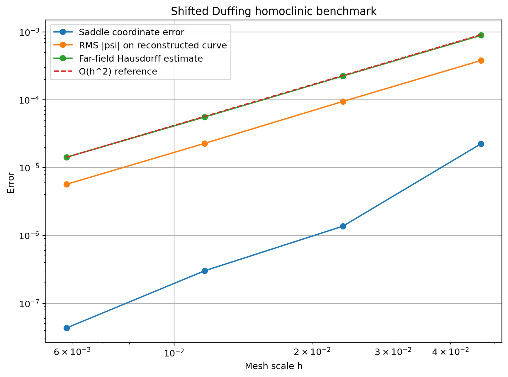

# Separatrix Toolkit

**A modular Fortran + Python toolkit for detecting saddle points and reconstructing
homoclinic and heteroclinic separatrix networks in 2-D scalar fields.**


The project is designed as a reusable numerical tool rather than code tied to one physical model.
The Fortran core operates only on a rectilinear grid and a scalar field

\[
\psi(x,y),
\]

so the same workflow can be used with streamfunctions, two-dimensional Hamiltonians,
phase portraits, vortex-boundary problems, and related level-set applications.

## Why this project

In many flow and Hamiltonian problems, the separatrix is not just another contour line:
it is the level set passing through a hyperbolic critical point and therefore determines
the boundary between qualitatively different trajectories.

A naive contouring workflow becomes fragile near a saddle because:

- the saddle level must be estimated accurately;
- the contour topology is locally ambiguous;
- several saddles may belong to one heteroclinic network;
- several independent separatrix networks may coexist in one field;
- finite output precision can change the apparent connectivity.

Separatrix Toolkit addresses these issues explicitly and stores the result as a graph-like
set of branches rather than assuming a single curve.

## What it does

- detects **multiple** saddle points automatically;
- refines saddle coordinates with a local quadratic least-squares model;
- reconstructs the four local saddle directions from the Hessian;
- extracts the corresponding level sets with marching squares;
- resolves ambiguous contour cells;
- assembles connected branches into separatrix networks;
- distinguishes homoclinic, heteroclinic, and boundary-going branches;
- supports uniform and nonuniform rectilinear grids;
- reports level-set quality metrics for the reconstructed branches;
- writes one machine-readable `separatrices.dat` file;
- provides a Python CLI for inspection, comparison, and publication-quality plotting.

## Architecture

```text
scalar field psi(x,y)
        |
        v
critical-point detection
        |
        v
quadratic saddle refinement
        |
        v
all hyperbolic saddles
        |
        v
group by saddle level psi_s
        |
        v
marching squares + local Hessian reconstruction
        |
        v
graph assembly
        |
        v
separatrix networks
        |
        +--> saddles.dat
        +--> separatrices.dat
        +--> diagnostics.txt
                    |
                    v
              Python / sepviz
                    |
                    +--> PNG / SVG / PDF
```

The numerical core does **not** contain parameters from a particular hydrodynamic model.

## Quick start

### 1. Build and test the Fortran core

The recommended build system is
[Fortran Package Manager](https://fpm.fortran-lang.org/).

```bash
fpm build
fpm test
```

### 2. Run an analytic example

```bash
fpm run -- examples/two_saddles.dat
```

The solver creates

```text
saddles.dat
separatrices.dat
diagnostics.txt
```

### 3. Install the Python visualization layer

```bash
pip install -e .
```

This installs the `sepviz` command.

Inspect the reconstructed topology:

```bash
sepviz inspect separatrices.dat
```

Plot the separatrices over the scalar field:

```bash
sepviz plot separatrices.dat \
    --saddles saddles.dat \
    --field examples/two_saddles.dat \
    --output separatrices.png
```

Export vector graphics for papers or presentations:

```bash
sepviz plot separatrices.dat \
    --saddles saddles.dat \
    --field examples/two_saddles.dat \
    --output separatrices \
    --formats png svg pdf
```

## Example topologies covered by tests

The regression suite includes qualitatively different cases:

| Case | Field | Expected topology |
|---|---|---|
| Single saddle | \(\psi=(x-x_0)^2-(y-y_0)^2\) | one hyperbolic critical point |
| Heteroclinic network | \(\psi=(x^2-1)^2-y^2\) | two saddles in one connected network |
| Duffing separatrix | \(\psi=\frac{y^2}{2}-\frac{x^2}{2}+\frac{x^4}{4}\) | homoclinic loops |
| Independent networks | \(\psi=(x^2-1)^2+0.2x-y^2\) | two saddle levels, two networks |
| Nonuniform grid | analytic saddle on a rectilinear nonuniform mesh | grid-independence check |

The implementation is therefore not hard-coded to a single saddle or a fixed three-branch topology.

## Hydrodynamic validation

The algorithm was also checked against a three-layer streamfunction dataset from the motivating
research workflow. The numerical core was not modified for this case.

The separatrix-reconstruction algorithm itself was developed independently. The hydrodynamic
validation field is based on the three-layer contour-dynamics model described by **Sokolovskiy
(1991, 1997)**; those works provide the model context used to generate the streamfunction field,
not the separatrix-reconstruction algorithm implemented here.


For one tested layer the code recovered one saddle, one homoclinic loop and two external branches.
The comparison with the previously constructed reference curve was within the scale of the original
grid, while the source field itself was stored only to four decimal places.

The research dataset is **not bundled as part of the reusable library**; the figure is included as
an application/validation example.

See [`docs/validation.md`](docs/validation.md),
[`docs/validation_model.md`](docs/validation_model.md), and
[`docs/gallery.md`](docs/gallery.md).

### Validation-model references

1. **Соколовский М. А.** Моделирование трехслойных вихревых движений в океане методом
   контурной динамики // *Известия АН СССР. Физика атмосферы и океана*. 1991. Т. 27, № 5.
   С. 550–562.
2. **Sokolovskiy M. A.** Stability Analysis of the Axisymmetric Three-Layered Vortex Using
   Contour Dynamics Method // *Computational Fluid Dynamics Journal*. 1997. Vol. 6, No. 2.
   P. 133–156.

BibTeX entries are available in [`REFERENCES.bib`](REFERENCES.bib).

## Input

The simplest input format is

```text
x y psi
```

with one grid point per row.

For an existing multi-column simulation table, extract any scalar field with

```bash
sepviz prepare simulation.dat field.dat --psi-col 3
```

The library can therefore be used with data generated by another Fortran, C/C++, Python,
MATLAB, Julia, or CFD/ocean-model workflow.

A Fortran caller can also provide an analytic or user-defined scalar function through the
`scalar_field` procedure interface.

## Output schema

`separatrices.dat` uses

```text
layer sep_id branch_id point_id x y saddle_start saddle_end
```

The endpoints encode topology explicitly:

- `saddle_start = saddle_end > 0` — homoclinic branch;
- both are nonzero and different — heteroclinic branch;
- one endpoint is `0` — branch reaching the computational boundary.

Neither the Fortran core nor the Python visualization layer assumes a fixed number of
saddles, branches, or networks.


## Grid convergence

Before public release, the solver was tested on two analytic problems with exact separatrices:
a shifted Duffing homoclinic system and a shifted two-saddle heteroclinic system.

Using grids from \(101\times101\) through \(801\times801\), the regular part of the reconstructed
separatrix showed approximately second-order convergence:

- Duffing far-field Hausdorff order: **1.99**;
- heteroclinic far-field Hausdorff order: **2.01**;
- RMS analytic level residual: approximately **second order** in both cases;
- heteroclinic saddle-position error: approximately **second order**.

The local neighborhood of a saddle is less uniform in a full-curve Hausdorff metric because
\(|\nabla\psi|\to0\).

See [`docs/convergence.md`](docs/convergence.md) for the benchmark definitions, detailed tables,
plots, and reproduction command.



## Numerical method

The main sequence is

\[
\psi(x,y)
\rightarrow
\nabla\psi=0
\rightarrow
\det H<0
\rightarrow
\psi_s
\rightarrow
\{\psi=\psi_s\}
\rightarrow
\text{separatrix graph}.
\]

Critical points are refined locally using

\[
\psi =
a+bX+cY+dX^2+eXY+fY^2.
\]

At a hyperbolic point,

\[
\det H < 0,
\]

and the four local separatrix directions follow from

\[
H_{11}X^2+2H_{12}XY+H_{22}Y^2=0.
\]

See [`docs/algorithm.md`](docs/algorithm.md).

## Configuration

The Fortran executable supports both command-line options and a namelist:

```bash
fpm run -- --config config/example.nml
```

or

```bash
fpm run -- field.dat \
    --radius-factor 2.0 \
    --min-cos 0.90 \
    --level-tol 1e-8
```

Negative tolerance values select automatic scale-dependent defaults.

## Python CLI

```text
sepviz plot      Plot one or more separatrix networks
sepviz prepare   Extract x, y, psi from a simulation table
sepviz compare   Compare a computed curve against a reference
sepviz inspect   Summarize networks, branches and point counts
```

Example comparison:

```bash
sepviz compare reference.dat separatrices.dat --candidate-schema toolkit
```

## Numerical precision

Topology near a saddle is sensitive to rounding because locally

\[
\psi-\psi_s=O(r^2).
\]

For numerically generated fields, preserve substantially more than four decimal places.
A practical target is roughly 10-12 or more significant decimal digits when the upstream
calculation supports them.

## Project layout

```text
src/                    Fortran numerical core
app/                    Fortran executable
python/separatrix_viz/  Python visualization package
test/                   Fortran regression tests
examples/               Small analytic example fields
notebooks/              Jupyter quick start
docs/                   Algorithm, validation and gallery
config/                 Example runtime configuration
.github/workflows/       Continuous integration
```

## Scope and current limitations

The current implementation targets **stationary two-dimensional scalar/Hamiltonian fields**
on rectilinear grids.

It is not yet intended as:

- a general invariant-manifold solver for non-autonomous systems;
- a replacement for adaptive continuation of stable/unstable manifolds;
- a solver for unstructured meshes;
- a proof of topology under arbitrarily noisy or under-resolved input data.

These limitations define the current scope of the implementation.

## Reproducibility

The repository includes:

- analytic regression tests;
- a GitHub Actions workflow;
- numerical diagnostics;
- a documented output schema;
- an example namelist;
- a Python comparison utility.

Run

```bash
fpm test
```

before changing the numerical core.

## Citation

A `CITATION.cff` file is included for research use.


## License

Apache License 2.0.
