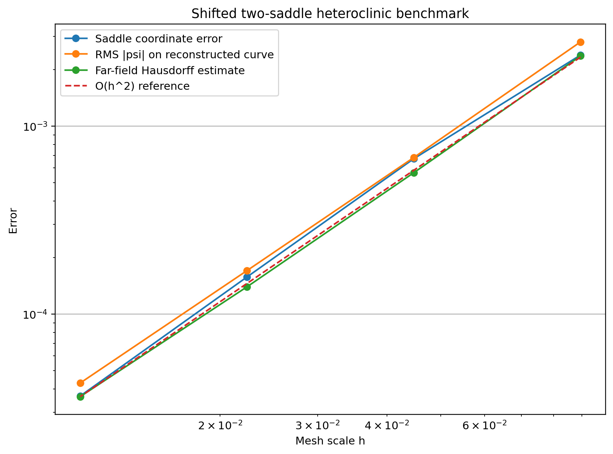

# Grid-convergence study

## Purpose

The convergence study was performed before the first public release to answer two questions:

1. Does the reconstruction converge to a known analytic separatrix as the grid is refined?
2. Which part of the algorithm controls the error near a hyperbolic point?

The motivating hydrodynamic dataset is not used for the convergence-rate estimate because only one
spatial resolution is currently available. It remains a separate validation case. The convergence
study therefore uses analytic scalar fields with known saddle positions and exact separatrix curves.

## Mesh sequence

Both benchmarks were evaluated on

\[
N=101,\;201,\;401,\;801,
\]

with the physical domain held fixed. Therefore the grid spacing is halved at every refinement.

The analytic fields were written with 16-digit scientific notation so that file-format rounding does
not contaminate the convergence experiment.

## Benchmark A: shifted Duffing homoclinic separatrix

The first field is the translated Duffing Hamiltonian

\[
\psi(X,Y)=\frac{Y^2}{2}-\frac{X^2}{2}+\frac{X^4}{4},
\qquad
X=x-x_0,\quad Y=y-y_0,
\]

with

\[
x_0=0.137,\qquad y_0=-0.083.
\]

The saddle is deliberately shifted away from grid nodes.

At the saddle level \(\psi=0\),

\[
Y=\pm X\sqrt{1-\frac{X^2}{2}},
\qquad |X|\le\sqrt{2},
\]

which gives two analytic homoclinic loops.

## Benchmark B: shifted two-saddle heteroclinic network

The second field is

\[
\psi(X,Y)=(X^2-1)^2-Y^2.
\]

The exact saddles are

\[
(x_0-1,y_0),\qquad (x_0+1,y_0),
\]

and the saddle level is

\[
\psi=0,
\qquad
Y=\pm(X^2-1).
\]

This benchmark checks both convergence and the multi-saddle heteroclinic topology.

## Error measures

For each grid the following quantities are measured:

- maximum saddle-coordinate error;
- RMS analytic level residual on the reconstructed curve;
- maximum analytic level residual;
- a symmetric far-field Hausdorff estimate;
- a symmetric far-field RMS geometric distance.

For the geometric metrics, points inside a fixed physical radius

\[
r=0.2
\]

around each exact saddle are excluded.

This distinction is intentional. Near a saddle,

\[
|\nabla\psi|\to0,
\]

so a small scalar level-set error can correspond to a disproportionately large positional error.
The fixed-radius metric measures the regular contour-reconstruction region independently of that
local conditioning effect.

The reported convergence order is obtained from

\[
E(h)\approx C h^p
\]

by a least-squares fit in \(\log E\) versus \(\log h\).

## Fitted convergence orders

| Benchmark | Saddle position | RMS level residual | Max level residual | Far-field Hausdorff | Far-field RMS |
|---|---:|---:|---:|---:|---:|
| Duffing homoclinic | 2.93 | 2.02 | 1.99 | 1.99 | 2.01 |
| Two-saddle heteroclinic | 2.02 | 2.01 | 1.94 | 2.01 | 1.98 |

The regular separatrix geometry is therefore approximately second-order convergent on both tested
analytic problems. The scalar level residual is also approximately second order.

The Duffing saddle-position sequence gives an apparent order above two. This is not claimed as a
general formal order of the saddle solver: the local quadratic reconstruction interacts favorably
with this polynomial benchmark. The two-saddle case gives the more representative value of about
second order.

## Detailed numerical results

### Duffing homoclinic benchmark

| N | h | Saddle error | RMS level residual | Far-field Hausdorff estimate |
|---:|---:|---:|---:|---:|
| 101 | 4.664762e-02 | 2.252476e-05 | 3.803245e-04 | 8.917987e-04 |
| 201 | 2.332381e-02 | 1.370108e-06 | 9.459553e-05 | 2.242709e-04 |
| 401 | 1.166190e-02 | 3.017893e-07 | 2.280005e-05 | 5.575721e-05 |
| 801 | 5.830952e-03 | 4.328863e-08 | 5.681318e-06 | 2.742742e-05 |

### Two-saddle heteroclinic benchmark

| N | h | Saddle error | RMS level residual | Far-field Hausdorff estimate |
|---:|---:|---:|---:|---:|
| 101 | 8.944272e-02 | 2.392005e-03 | 2.810639e-03 | 2.366404e-03 |
| 201 | 4.472136e-02 | 6.715531e-04 | 6.816503e-04 | 5.657519e-04 |
| 401 | 2.236068e-02 | 1.577493e-04 | 1.705723e-04 | 1.398286e-04 |
| 801 | 1.118034e-02 | 3.669731e-05 | 4.304212e-05 | 3.642608e-05 |

## Interpretation of the saddle neighborhood

A separate full-curve diagnostic, including the shrinking local reconstruction region around the
saddle, is less uniform than the far-field result.

This does not contradict the second-order level residual. Near a hyperbolic point the gradient
vanishes, so the conversion

\[
\delta\psi \longrightarrow \delta n
\]

from scalar error to normal geometric displacement becomes ill-conditioned.

The current implementation is therefore best described as:

> approximately second-order in the regular contour region, with the immediate saddle neighborhood
> remaining the accuracy-limiting region for a uniform full-curve geometric norm.

The local reconstruction already provides the correct topology. A future improvement can target
higher-order geometry near the saddle without changing the rest of the architecture.

## Reproduction

Build the Fortran executable, then install the optional convergence dependency:

```bash
pip install -e ".[convergence]"
```

Run:

```bash
python tools/run_convergence.py \
    --solver /path/to/separatrix_toolkit \
    --sizes 101 201 401 801 \
    --output convergence_runs
```

The committed results in
[`docs/convergence/convergence_results.csv`](convergence/convergence_results.csv)
were produced by this script.

## Figures




## Conclusion

The study provides sufficient numerical evidence for a public pre-1.0 release:

1. saddle localization converges on both analytic benchmarks;
2. the scalar separatrix-level residual is approximately second order;
3. the regular geometric reconstruction is approximately second order;
4. the current limitation is localized to the immediate hyperbolic neighborhood and is documented
   explicitly.

This supports publication as a tested research-software project without overclaiming uniform
second-order convergence through the saddle itself.
