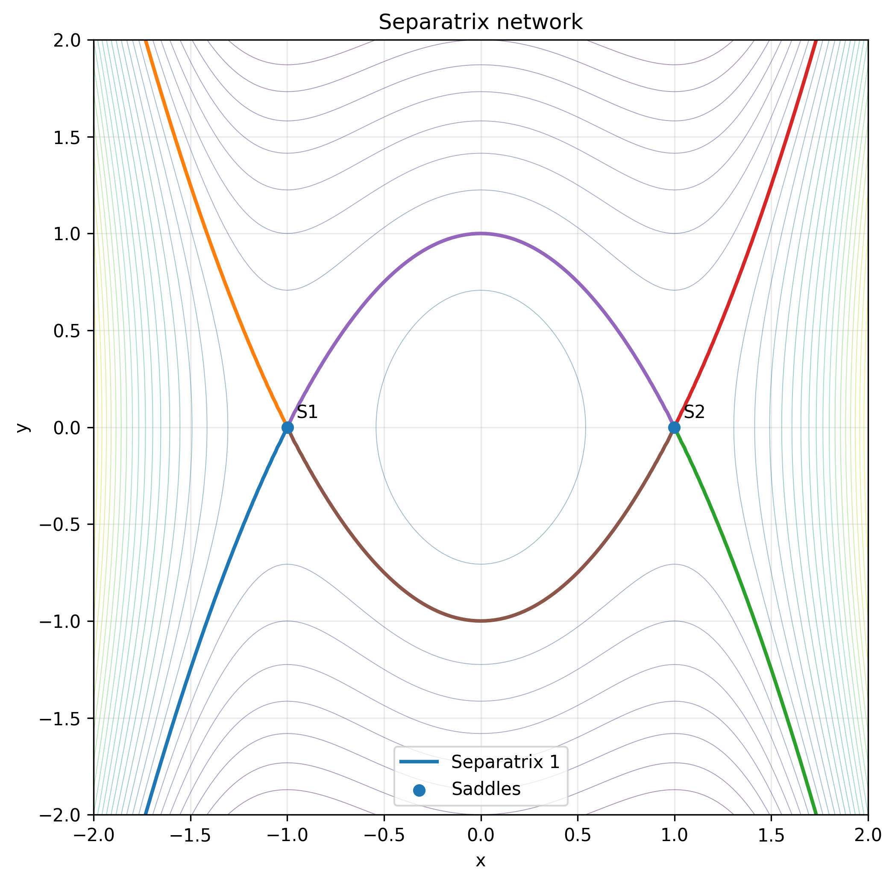
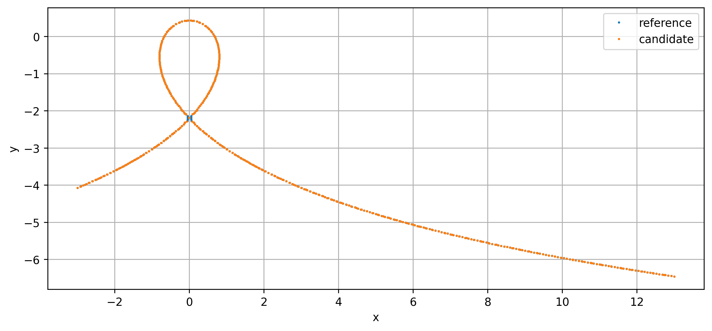

# Gallery

## Analytic two-saddle heteroclinic network

This analytic case validates the ability to keep multiple saddle points inside one connected
heteroclinic separatrix network.

## Hydrodynamic streamfunction example

The hydrodynamic example was generated from a three-layer streamfunction dataset used during
validation. It is intentionally shown as an application example rather than being embedded into
the numerical core.
